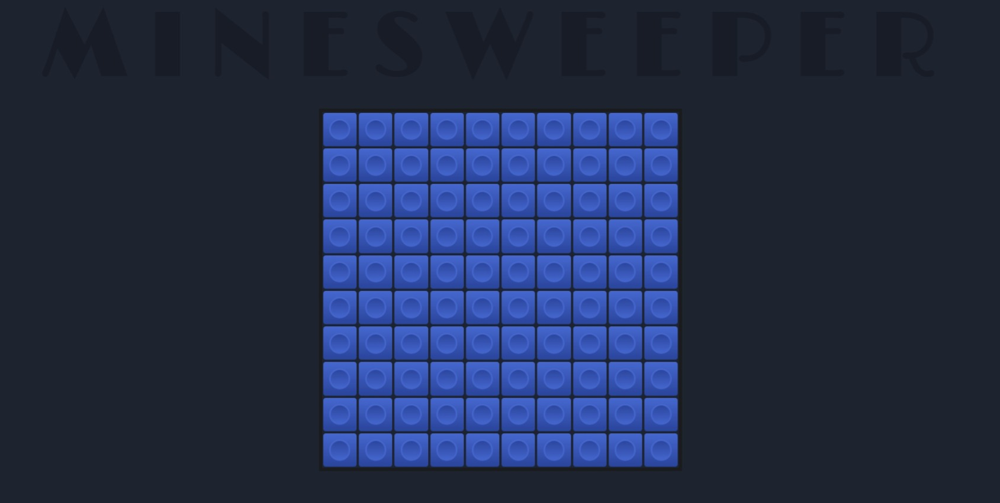

# 💣 MINESWEEPER - GAME

## DESCRIPTION
This is a simple implementation of the classic Minesweeper game built using TypeScript. The game allows players to reveal blocks on a grid while avoiding hidden mines. 

## FEATURES

- Dynamic grid generation based on specified dimensions.
- Random mine placement with customizable mine percentage.
- Number indicators revealing adjacent mines.
- Left-click to reveal blocks, right-click to flag potential mines.
- Win/lose conditions with appropriate messages.
- Developer mode to reveal all mines for testing.

## USAGE
To run the game, simply open the `index.html` file in a web browser. The game board will be displayed, and you can start playing by left-clicking to reveal blocks and right-clicking to flag potential mines.

## CUSTOMIZATION
You can customize the game by adjusting parameters in the `app` class constructor:
- `numberCase`: Number of rows/columns on the game board (default is `10`).
- `percentage`: Percentage of mines on the game board (default is `12.5`).

Additionally, you can enable developer mode by setting the `isDevMode` property to `true` in the constructor. This will reveal all mines on the board for testing purposes.

## FILE STRUCTURE
- `index.html`: HTML file containing the game interface.
- `style/main.css`: CSS file for styling the game interface.
- `main.ts`: TypeScript file containing the game logic.
- `main.js`: Compiled JavaScript file generated from `script.ts`.
- `README.md`: This file providing information about the project.

## REQUIREMENTS
- Web browser with JavaScript enabled.
- TypeScript compiler (optional, if you want to modify the source code).

##  COMPILATION
```tsc --outFile main.js main.ts```

## LICENSE
This project is licensed under the [MIT License](LICENSE).
